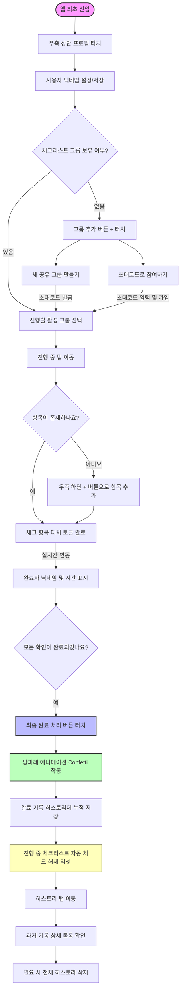

# 햇꼬 (Hatggo) 공동 체크리스트 - 기능명세서 및 유저 플로우

본 문서는 공동 체크리스트 서비스 **햇꼬 (Hatggo)** 앱의 핵심 기능명세서 및 유저 플로우(User Flow)에 대한 설계 문서입니다.

---

## 1. 서비스 개요
*   **서비스명**: 햇꼬 (Hatggo)
*   **핵심 컨셉**: 가족, 룸메이트, 연인 등 공동체 멤버들이 외출 전 체크리스트나 집안일 등의 업무를 분담하고, 실시간으로 완료 상태를 공유 및 초기화하는 모바일 협업 체크리스트 플랫폼입니다.
*   **디자인 아이덴티티**: 라벤더 퍼플(`#9B89FF`)과 민트 그린(`#6BCEB4`), 웜 화이트(`#FDFCF8`) 바탕의 감성적이고 정돈된 모던 UI/UX를 제공합니다.

---

## 2. 유저 플로우 (User Flow)

아래 다이어그램은 사용자가 앱에 진입한 후 체크리스트를 생성하고 진행하여 히스토리를 아카이빙하기까지의 전체적인 흐름을 나타냅니다.

---

## 3. 핵심 기능 요구사항 명세

### 3.1 회원화 및 프로필
*   **F-NIC-01: 닉네임 개인화**
    *   공동 작업 시 체크 항목을 완료한 사람이 누구인지 구분하기 위해 활동 닉네임을 설정합니다.
    *   앱 우측 상단 프로필 다이얼로그를 통해 언제든지 자유롭게 닉네임을 수정할 수 있습니다.

### 3.2 그룹 관리 (Groups)
*   **F-GRP-01: 로컬 단독 체크리스트**
    *   서버 통신 없이 본인 스마트폰 내에만 로컬로 저장하여 쓰는 체크리스트 그룹입니다.
*   **F-GRP-02: 실시간 공유 그룹 생성**
    *   그룹 타이틀을 입력하고 생성하면 서버에 연동되는 공유용 체크리스트가 만들어지며, 고유의 6자리 초대코드(예: `A7B8C9`)가 자동 발급됩니다.
*   **F-GRP-03: 초대코드로 그룹 합류**
    *   다른 멤버가 공유해 준 초대코드를 복사하여 입력하면 실시간 동기화 그룹에 참여자로 등록됩니다.
*   **F-GRP-04: 활성 그룹 스위칭**
    *   다양한 리스트(예: "외출 전 확인", "마트 장보기 목록", "청소 당번") 중 현재 모니터링 및 진행할 활성 그룹을 탭하여 전환합니다.

### 3.3 체크리스트 진행 및 완료 (Active Checklist)
*   **F-ACT-01: 체크리스트 항목 등록 및 삭제**
    *   체크리스트 내에 자유롭게 신규 할 일 항목을 추가하고 제거할 수 있습니다.
*   **F-ACT-02: 실시간 완료자 태깅 및 토글**
    *   항목을 체크 완료 상태로 변경 시, 완료를 체크한 참여자의 **닉네임**과 **완료 시간**이 항목 하단에 태깅됩니다.
    *   모든 진행 상황은 공유 그룹 멤버의 디바이스에 실시간(SSE/WebSocket)으로 반영됩니다.
*   **F-ACT-03: 최종 완료 처리 및 자동 리셋**
    *   리스트 확인 완료 후 하단의 '완료 처리' 버튼을 선택하면 화면에 꽃가루 효과(Confetti)가 나타납니다.
    *   현재까지의 체크 상태가 타임스탬프와 함께 히스토리에 누적 저장되고, 다음 사용을 위해 모든 체크 상태는 초기화(Uncheck)됩니다.

### 3.4 히스토리 관리 (History)
*   **F-HIS-01: 완료 기록 보관 및 아카이빙**
    *   '완료 처리' 버튼에 의해 생성된 기록이 완료일시 역순으로 정렬되어 보여집니다.
*   **F-HIS-02: 상세 항목 펼치기/접기**
    *   아코디언(ExpansionTile) 디자인을 통해 해당 시점에 어떤 항목들이 완료 처리되었었는지 세부 정보를 펼쳐서 확인할 수 있습니다.
*   **F-HIS-03: 히스토리 비우기**
    *   필요한 경우 히스토리 전체를 지우고 처음부터 다시 아카이빙을 시작할 수 있습니다.

### 3.5 시스템 및 기타 기능
*   **F-SYS-01: 홈 화면 위젯 실시간 연동**
    *   앱에 진입하지 않더라도 모바일 홈 화면에서 현재 활성화된 체크리스트 현황을 실시간으로 위젯에서 확인 가능합니다.
*   **F-SYS-02: 지연 동기화 (Deferred Sync)**
    *   위젯에서 백그라운드로 처리한 체크 로그 및 변동사항은 사용자가 앱을 다시 실행(Resume)하는 순간 서버와 순차 동기화됩니다.
*   **F-SYS-03: 데일리 루틴 자동 리셋 스케줄러**
    *   매일 자정(00:00)에 "DAILY_ROUTINE" 유형으로 등록된 공유 그룹들의 체크 상태를 서버에서 자동으로 일괄 초기화하고 업데이트 알림을 브로드캐스트합니다.
